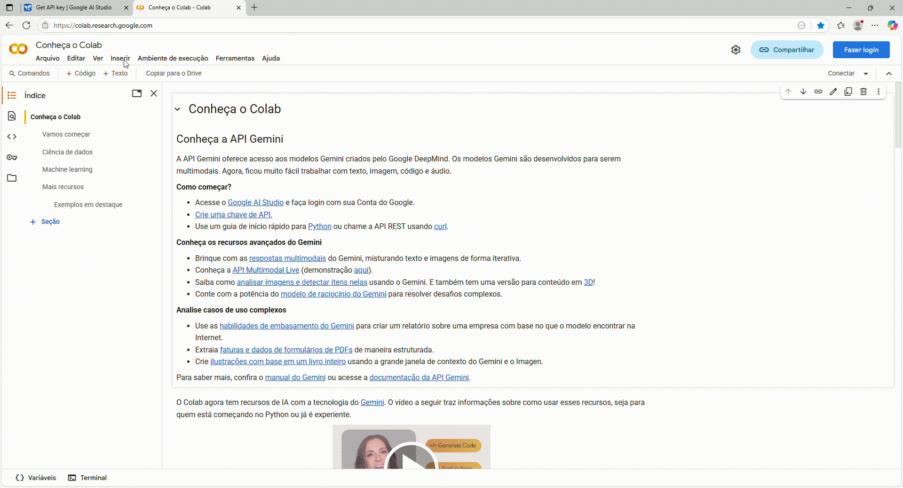

# 🛒 🛍️ Lista de Compras Mágica no Colab ✨  
*por Bruna Santos*

Bem-vindo(a) ao projeto Lista de Compras! Este é um chatbot simples e divertido, feito em Python e pensado para rodar no Google Colab, que te ajuda a organizar e otimizar suas compras e não esquecer nenhum item. É tão fácil de usar que até uma criança de 10 anos consegue! 🎉

## 👋 Sobre o Projeto

Cansado de esquecer o que precisa comprar no mercado? Ou de se perder entre o que ainda falta? 🙋‍♀️🙋‍♂️

Este chatbot foi criado para resolver esses probleminhas de forma interativa e simpática. Ele funciona como um assistente pessoal para suas compras, permitindo que você:

* Adicione itens que precisa comprar.
* Remova itens da lista caso mude de ideia.
* Veja sua lista completa a qualquer momento, com o status de cada item!

## 🌟 Funcionalidades Principais

* **Adicionar Itens à Lista:** Diga o que você quer comprar, e o bot anota!
* **Controle de Quantidades:** Especifique quantos de cada item você precisa.
* **Remover Itens da Lista:** Mudou de ideia sobre um produto? Sem problemas!
* **Visualização Clara:** Veja sua lista completa, com indicação do que já foi pego e o que ainda falta.
* **Interface Amigável:** Comandos simples e emojis para deixar tudo mais divertido! 😄

## 🚀 Como Executar no Google Colab

Este projeto foi feito para ser usado no Google Colab, um ambiente online e gratuito para rodar código Python.

Para testar o codigo segue o passo a passo abaixo:

 **Clique nesse botão:** Vá diretamente para o ambiente de teste do colab, 

## 🔔 Só um lembrete:

Para rodar o código no Colab, você vai precisar de uma chave de API do Google Studio. Isso é necessário para conseguir realizar o teste. 
https://aistudio.google.com/welcome

Confira o passo a passo no vídeo abaixo para aprender como gerar sua chave de API. Você pode se cadastrar facilmente com sua conta Google! 😊

Para começar, além de criar sua chave de API no Google AI, é necessário habilitá-la no Colab para poder realizar os testes. Para te ajudar, criei um vídeo explicativo mostrando como fazer todo esse processo. Confira abaixo!

## 📸 Veja em Ação!

Gostaria de compartilhar com vocês uma demonstração de como o chatbot 🤖 funciona. Espero que gostem!

**Exemplo de interação:**

